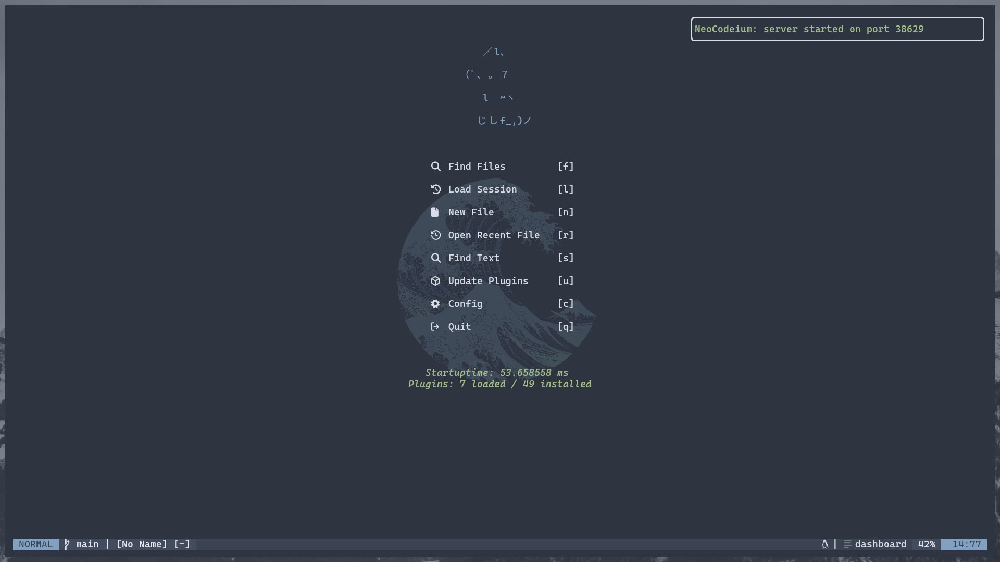
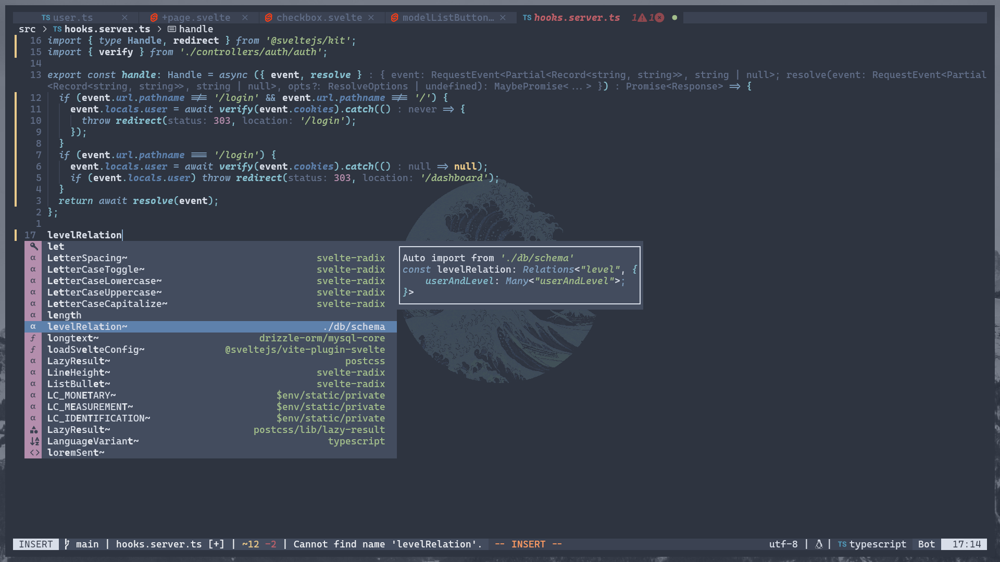
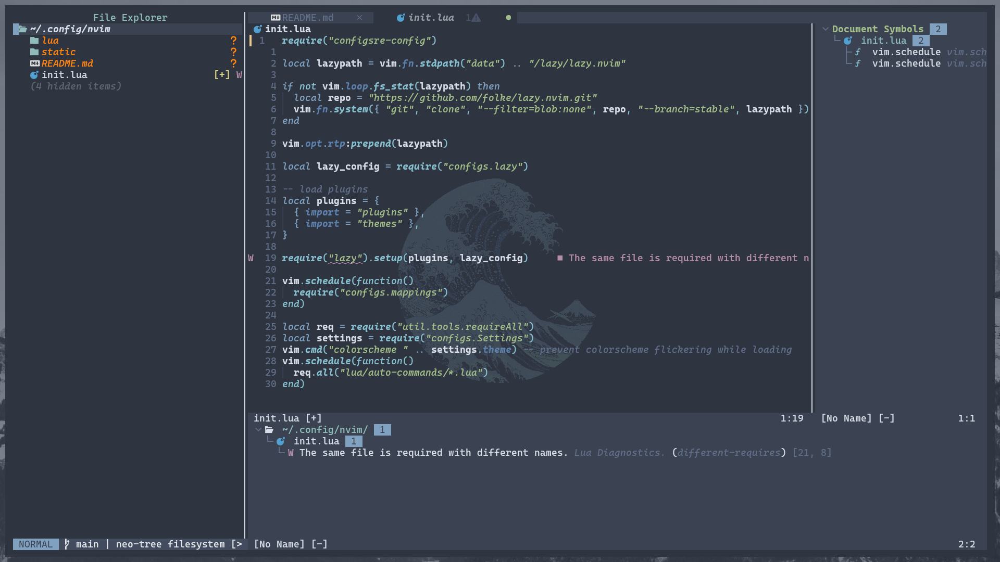

# Vanilla-nvim

#### a simple and fast neovim config

### Structure folder


```
.
├── init.lua                    # initial files for neovim
├── lua
│   ├── auto-commands           # auto run files after all plugins loaded
│   │   ├── tools.lua
│   │   └── ui.lua
│   ├── configs
│   │   ├── lazy.lua
│   │   ├── mappings.lua
│   │   ├── pre-config.lua
│   │   └── Settings.lua        # settings for neovim
│   ├── plugins
│   │   ├── all.lua
│   │   ├── plugins.lua
│   │   ├── goes.lua
│   │   └── here.lua
│   ├── themes
│   │   ├── all.lua
│   │   ├── themes.lua
│   │   ├── goes.lua
│   │   └── here.lua
│   └── util                    # utility files
│       ├── tools
│       │   └── requireAll.lua
│       └── ui
│           ├── colorscheme.lua
│           └── completionStyle.lua
├── README.md
└── static                      # static files
    ├── kaltsit_catppuccin.png
    ├── kaltsit_cropped.jpg
    ├── kaltsit_everforest.png
    ├── kaltsit_gruvbox.png
    └── kaltsit_masked.webp
```

### ScreenShot




